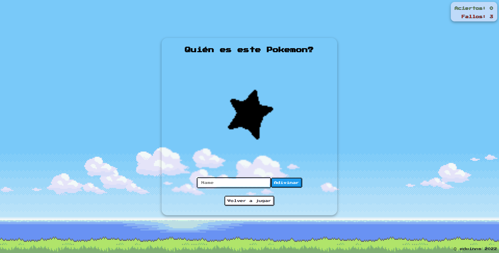

# Guess-Pokemon

The application is a representation of the classic mini-game Guess-Pokemon.

The project was created with Vite and React.

This application has been created for educational purposes. The main idea and specifications were taken from [@goncy](https://github.com/goncy).

## Installation

- Clone the project.

- Run the command to install the dependencies.

```bash
npm install
```

- Run the command to start the development server.

```bash
npm run dev
```

## How to deploy in GH-Pages

- Add base in the vite.config.js file.

```js
export default defineConfig({
    base: '/Guess-Pokemon/',
    ...,
}
```

- Run the command to build the project.

```bash
npm run build
```

- Add and push the static files generated in /dist.

```git
git add dist -f
git commit -m 'Adding dist'.
git subtree push --prefix dist origin gh-pages
```

## Usage

- Go to [this page](https://edwinnm.github.io/Guess-Pokemon/) for a demonstration.

  
